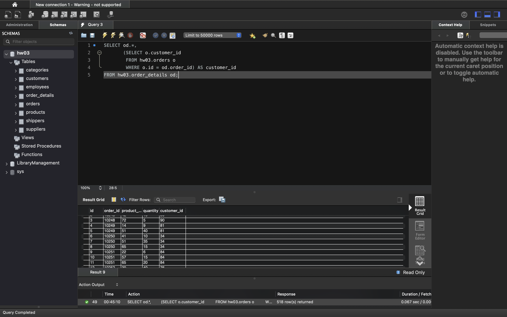
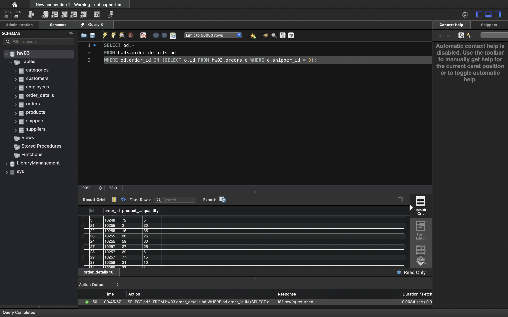
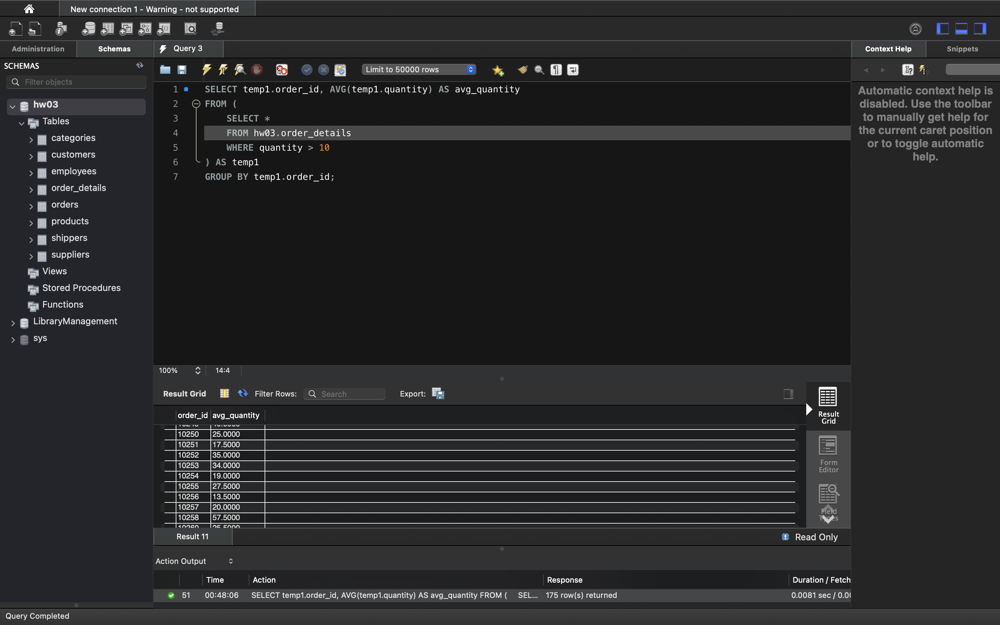
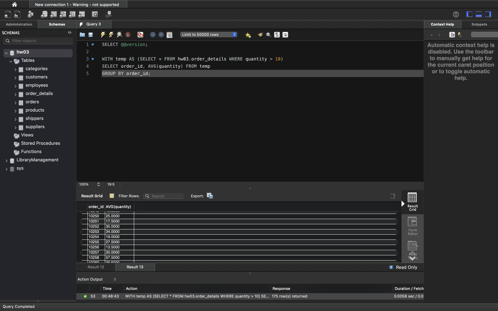
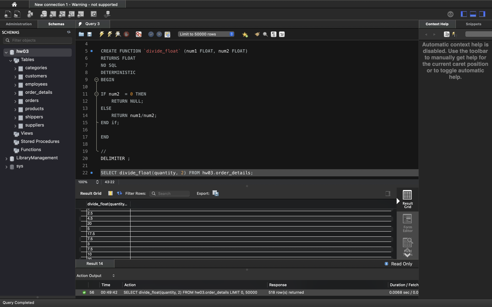

# SQL Relation DB HW05 Опис домашнього завдання

## 1. Напишіть SQL запит, який буде відображати таблицю order_details та поле customer_id з таблиці orders відповідно для кожного поля запису з таблиці order_details.



```sql
SELECT od.*, 
       (SELECT o.customer_id 
        FROM hw03.orders o 
        WHERE o.id = od.order_id) AS customer_id
FROM hw03.order_details od;
```

## 2. Напишіть SQL запит, який буде відображати таблицю order_details. Відфільтруйте результати так, щоб відповідний запис із таблиці orders виконував умову shipper_id=3.



```sql
SELECT od.* 
FROM hw03.order_details od
WHERE od.order_id IN (SELECT o.id FROM hw03.orders o WHERE o.shipper_id = 3);
```

## 3. Напишіть SQL запит, вкладений в операторі FROM, який буде обирати рядки з умовою quantity>10 з таблиці order_details. Для отриманих даних знайдіть середнє значення поля quantity — групувати слід за order_id.


```sql
SELECT temp1.order_id, AVG(temp1.quantity) AS avg_quantity
FROM (
    SELECT * 
    FROM hw03.order_details 
    WHERE quantity > 10
) AS temp1
GROUP BY temp1.order_id;
```

## 4. Розв’яжіть завдання 3, використовуючи оператор WITH для створення тимчасової таблиці temp. Якщо ваша версія MySQL більш рання, ніж 8.0, створіть цей запит за аналогією до того, як це зроблено в конспекті.


```sql
SELECT @@version;

WITH temp AS (SELECT * FROM hw03.order_details WHERE quantity > 10)
SELECT order_id, AVG(quantity) FROM temp
GROUP BY order_id;
```


## 5. Створіть функцію з двома параметрами, яка буде ділити перший параметр на другий. Обидва параметри та значення, що повертається, повинні мати тип FLOAT.

* Використайте конструкцію DROP FUNCTION IF EXISTS. Застосуйте функцію до атрибута quantity таблиці order_details . Другим параметром може бути довільне число на ваш розсуд.



```sql

DROP FUNCTION IF EXISTS divide_float;
DELIMITER //

CREATE FUNCTION `divide_float` (num1 FLOAT, num2 FLOAT)
RETURNS FLOAT
NO SQL
DETERMINISTIC
BEGIN

IF num2  = 0 THEN 
	RETURN NULL;
ELSE 
	RETURN num1/num2;
END if;

END

//
DELIMITER ;

SELECT divide_float(quantity, 2) FROM ORDERS_HW3.order_details;
```


